We will need to start by downloading a [Windows 10 ISO](https://www.microsoft.com/en-us/software-download/windows10).  

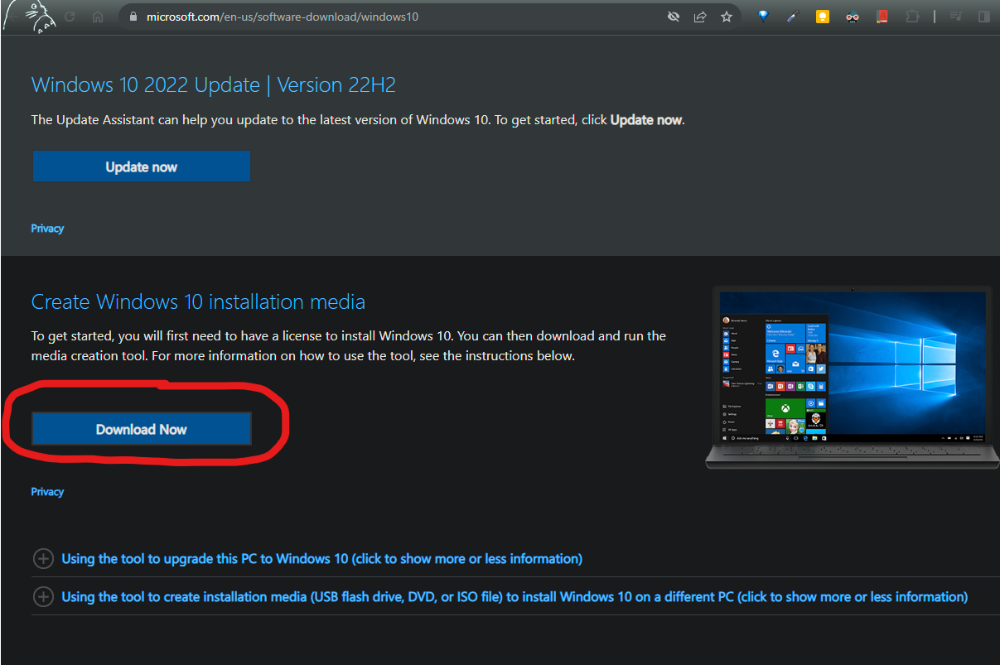  

Open the `.exe` that was downloaded, so you can create an ISO.  

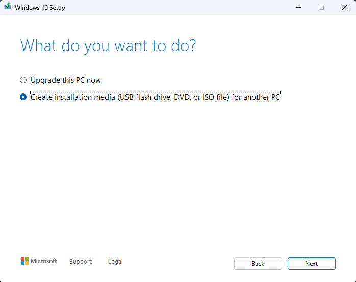  

Select Create installation media for another PC and use the recommended options. Then select ISO file, so we can upload it to VirtualBox. Choose a location to save the ISO and allow the program to run its course.

After it has finished, go to VirtualBox and select new. Add a name and location of the ISO.

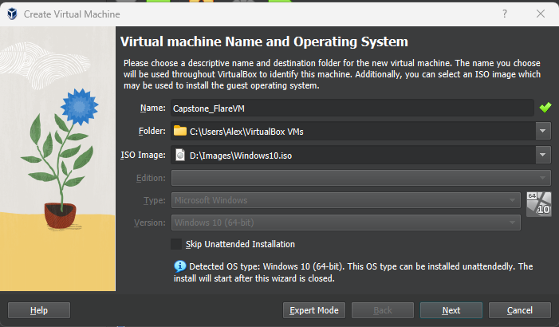

If you have a product key, go ahead and use the unattended installation. Otherwise click the Skip Unattended Installation option before selecting next.

FlareVM suggests 80 GB of disk space and 2 GB of memory. After you have selected the options for your VM go ahead and start it up. Go through the options until you reach the product key. Select I don't have a product key.

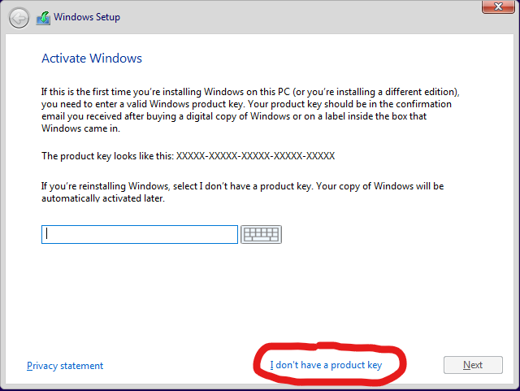  

I am going to select Windows 10 Pro, select what you want I don't believe it will matter for FlareVM. Select a clean install and the disk to install to.

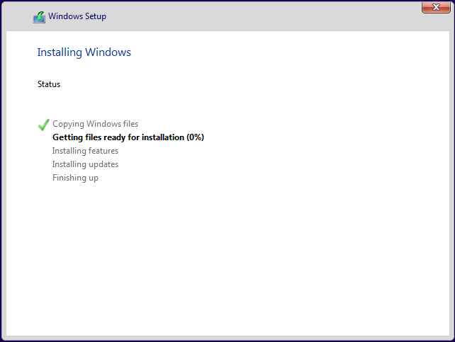

Go through the gauntlet of privacy choices, random ads, and Cortana. Finally you will get to this screen, which means you are so close!

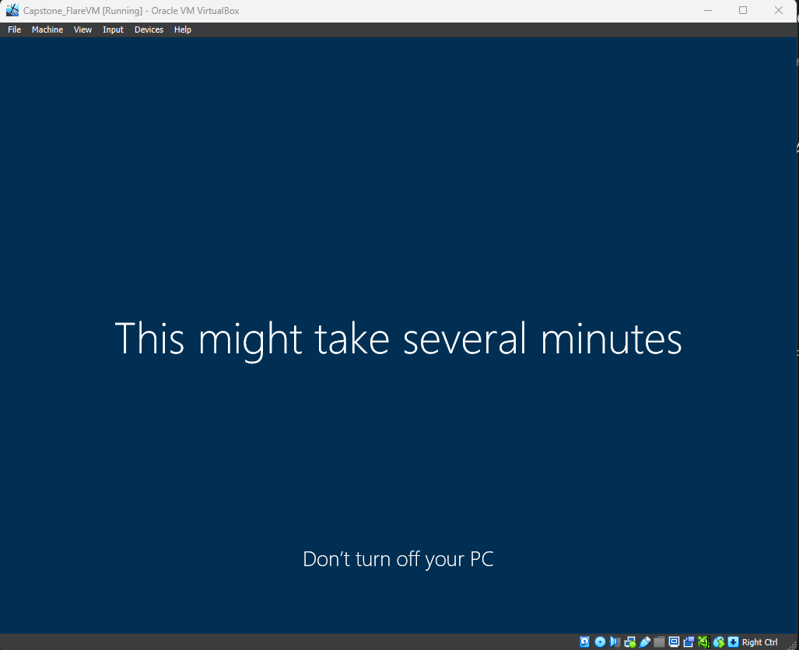  

We will now add the guest additions CD to the machine like we did for Windows XP. Afterwards we will have access to full screen and copy paste between host and VM.

We need disable Windows updates by following this [guide](https://www.windowscentral.com/how-stop-updates-installing-automatically-windows-10). I chose to disable updates permanently.  

New we are going to disable [tamper protection](https://www.tenforums.com/tutorials/123792-turn-off-tamper-protection-microsoft-defender-antivirus.html) and any anti-malware solution ([Windows Defender](https://www.windowscentral.com/how-permanently-disable-windows-defender-windows-10)) using the guides in the links. There is also a script you can use to disable through group policies [here](https://github.com/jeremybeaume/tools/blob/master/disable-defender.ps1).

We now want to take a snapshot of our device. After we will want to open PowerShell and run as administrator.

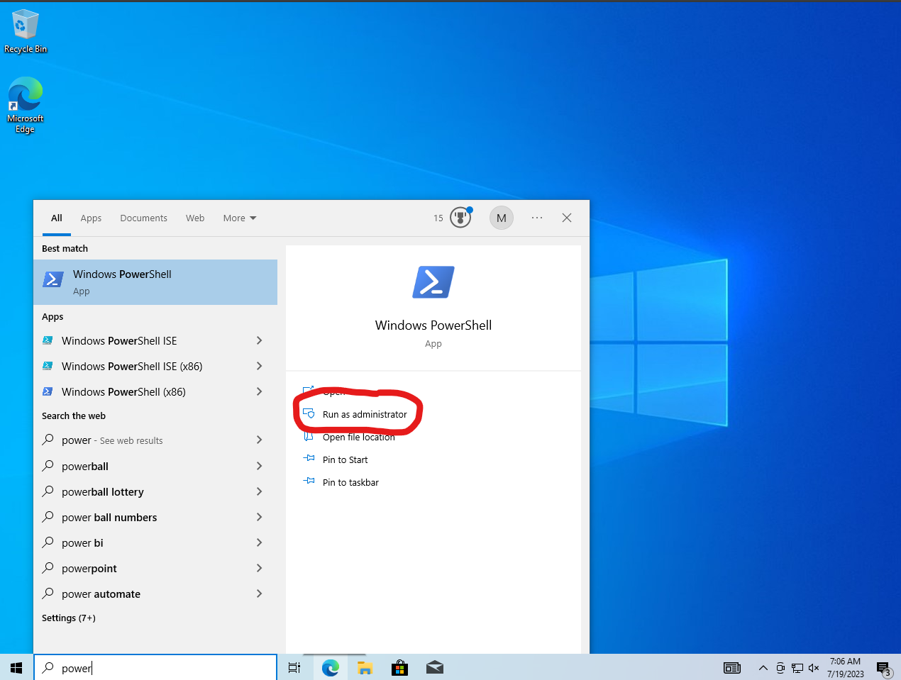  

We will want to copy and paste this code to Powershell. We can add a shared clipboard.

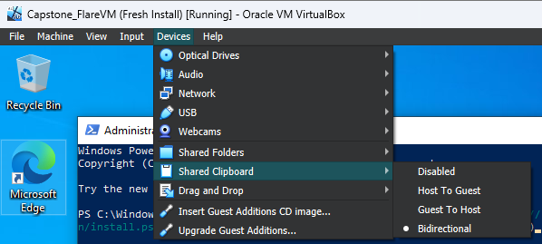

Here is the code we want to copy and paste into PowerShell:

`(New-Object net.webclient).DownloadFile('https://raw.githubusercontent.com/mandiant/flare-vm/main/install.ps1',"$([Environment]::GetFolderPath("Desktop"))\install.ps1")` 

We then want to move to our Desktop where it was installed using the command:

`cd $([Environment]::GetFolderPath("Desktop"))`

Next we want to unblock the installation script by running:

`Unblock-File .\install.ps1`

Then enable script execution by running:

`Set-ExecutionPolicy Unrestricted`

I selected Yes to All. We are now going to run the script:

`.\install.ps1`

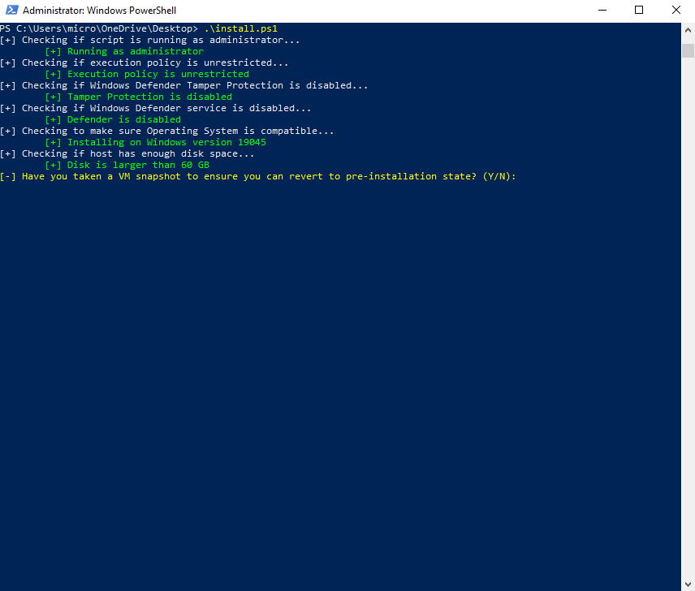 

It will ask for your user's password and begin the installation process. It will then pop up a GUI and ask where you want to install the tools. I chose the default tools.

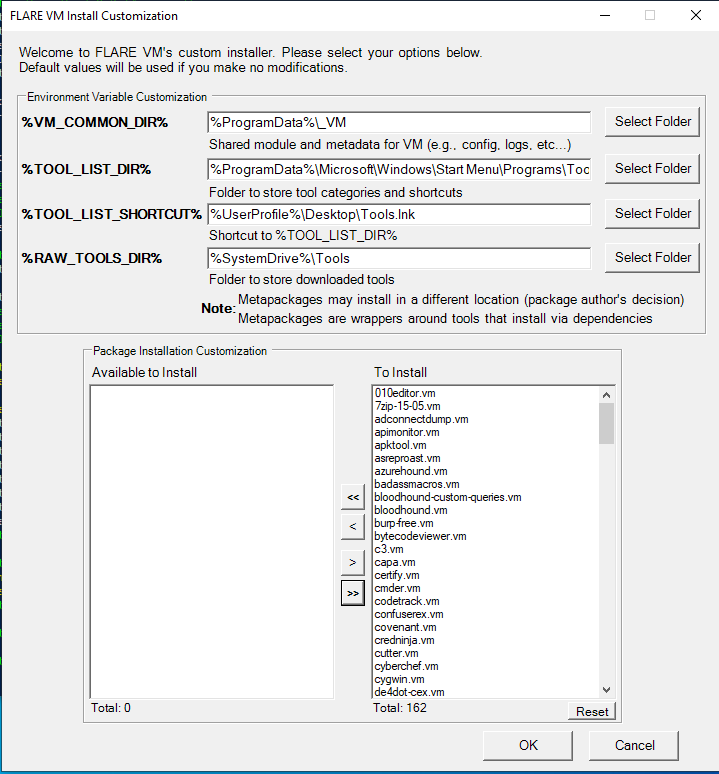  

This may take awhile, so go and make yourself some tea or a couple cups of tea!

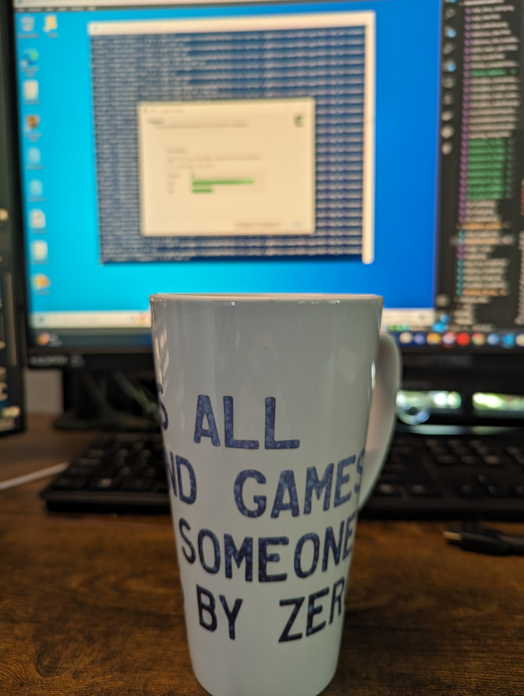 

Finally! It has finished installing, but wants you to check all the errors in the log.txt file.

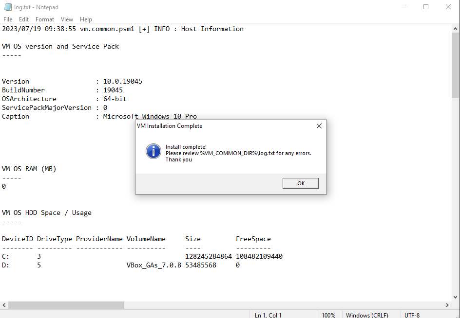

This is a good time to go through and fix any errors founds. After you have fixed any of your errors go and shutdown your VM. Then go into the settings of the VM.

In the network tab disable the first adapter.

In the second adapter tab, enable it and attach to Host-only Adapter. In the name section select the Host-only adapter you created in the Network_setup guide.

Hit ok and start up the VM. Once it is started up, create a new snapshot.

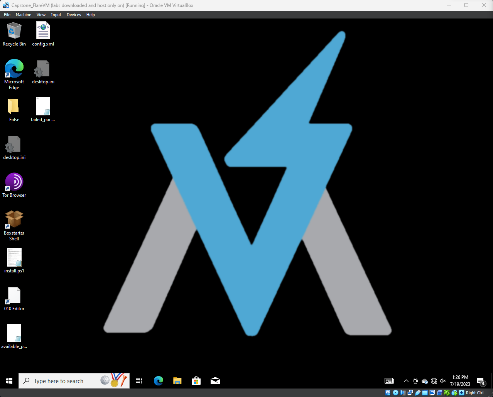