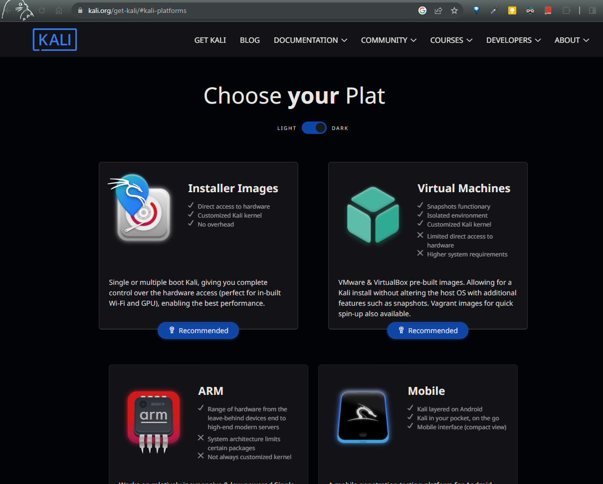
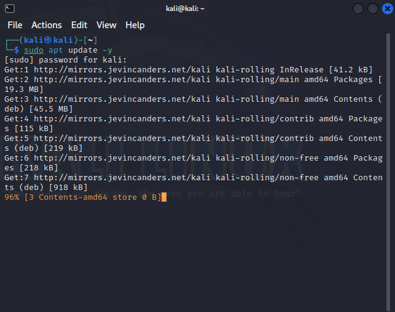

Start by going to the [Kali Linux website](https://www.kali.org/get-kali/#kali-platforms). Here you will have many options of what type of download you will want to have. For this project we will simplying be going with one of the Virtual Machines.  

  

After selecting Virual Machines, you will have options of choose your hypervisor. We will select VirtualBox, since that is what we have already installed.  

Since our file has been zipped with 7zip, we first need to unzip the image by running  

 `7z x kali-linux-2023.2-virtualbox-amd64.7z` 
 
 in the terminal where the file is located. (your file may have a different name) If you are on windows you may need to download the `.exe` by going to [7zip's website](https://www.7-zip.org/).

Going into the extracted folder we can double click on the `.vbox` file and it will open up VirtualBox with the machine inside of it. We can then either change some of the system settings by adding more processors and memory or just simply start the machine. I am going to start the machine.  

  

After powering up the device you are asked to log into the system. The username is `kali` and password is `kali`.  

The image already has virtualbox tools installed, so you can go full screen! From here we want to update the system. Open a terminal and run the following commands.  

```
sudo apt update -y
sudo apt upgrade -y
```  

  

The upgrade could take awhile depending on the image you are using.  

After the upgrade has finished create a snapshot of the image by going to the Machine tab and selecting `Take Snapshot...`  


Kali Linux should be ready for normal use.