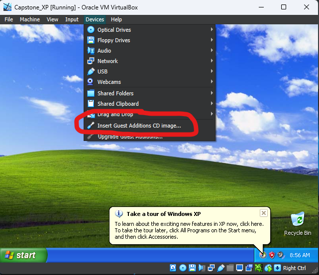
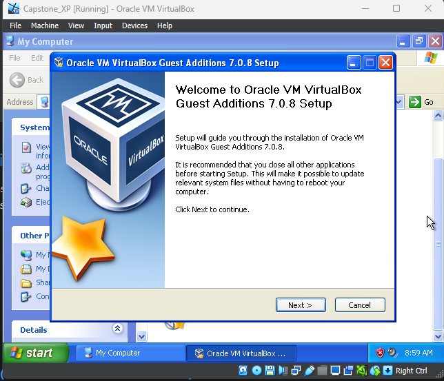

Start by downloading the ISO from [archive.org](https://archive.org/details/WinXPProSP3x86) and selecting the ISO IMAGE download option.  

  

We are using the x86 version (32-bit) because the samples from the textbook are 32-bit programs.  

Using VBox we start by creating a New VM. We name the VM and select where the ISO is located. The next screen will ask you to create a Username, Password, and add the product key located on the download website.  

  

I then gave it 4 GB of memory, 2 CPUs, and 20 GB of disk space. I then selected finish and the VM started up. It starts to install Windows and follow the prompts that may pop up.  

  

After setup is complete it will install XP using the information given from VirtualBox. It will then run some updates and need to reboot.  

After reboot we will want to install the Guest Additions tools. This will allow us to work in full screen mode plus other features.

  

After you have inserted the CD, go and double click on drive that was just attached in explorer.  

  

Click through the dialogs and allow it to install. I kept all default options. Once it is finished installing, reboot the system. After rebooting, this is a great place to take a snapshot of the system. This way we don't have to wait 1,000 years for XP to boot up every time.

Next we will want to set up host only network by following our guide.