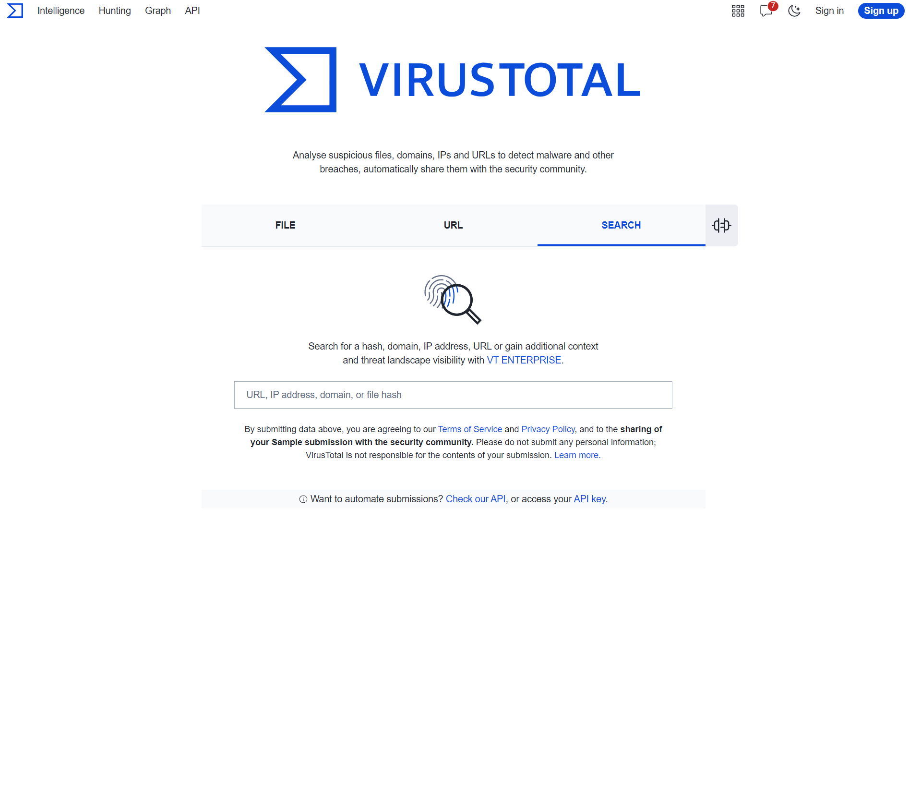
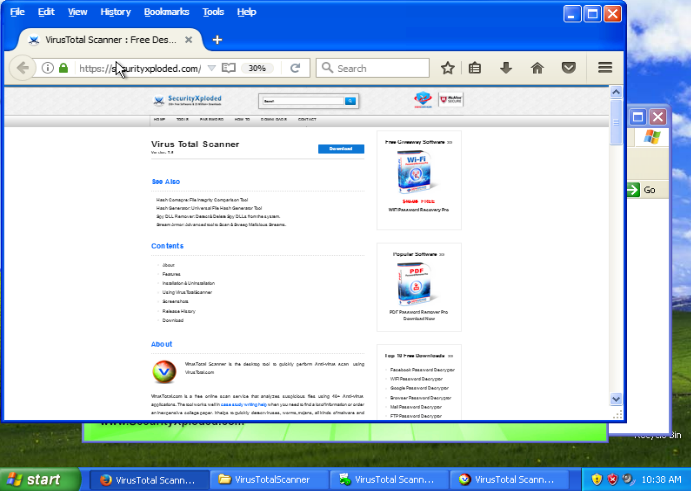
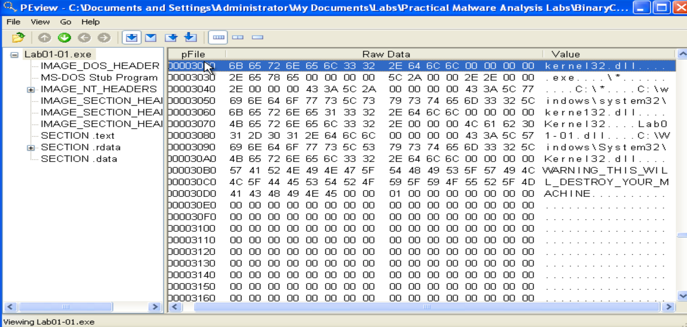
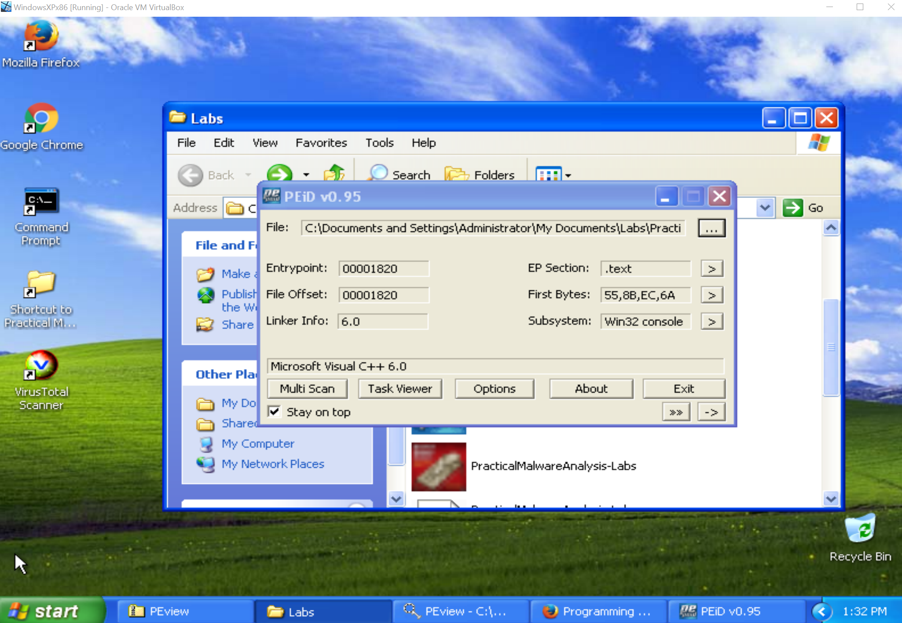
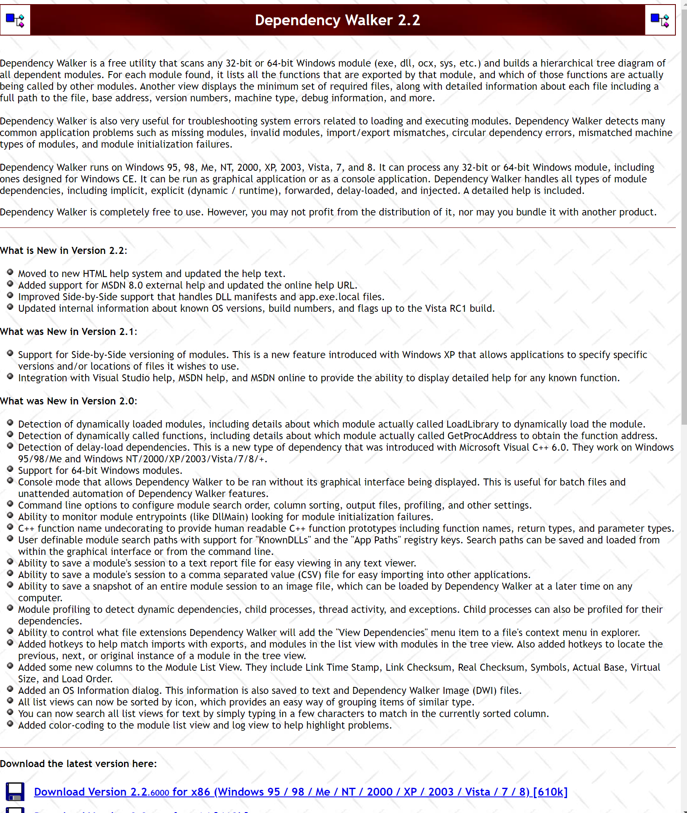

# Static Analysis of Lab 1 
Objectives for the first sample of malware:
1. Upload the files to [Virtus Total](http://www.VirusTotal.com/) and view the reports. Does either file match any existing antivirus signatures?
2. When were these files compiled?
3. Are there any indications that either of these files is packed or obfuscated? If so, what are these indicators?
4. Do any imports hint at what this malware does? If so, which imports are they?
5. Are there any other files or host-based indicators that you could look for on infected systems?
6. What network-based indicators could be used to find this malware on infected machines?
7. What would you guess is the purpose of these files?

To begin the static analysis of, the textbook recommends to first take a hash of the `.exe` and `.dll` files. This will provide the analyst with a hash that can be search on the internet and possibly provide more useful infomration about the files and virus. 

MD5 Hash of Lab 1 

This hash can be searched for on the [Virus Total Webiste](https://www.virustotal.com/gui/home/search)

However, the virus total website search tool is not supported in Windows XP. I chose to proceed with Virus Total scan through Virus Total Scanner Application which is still supported on Windows XP. 

The search did not provide any useful information as the hash was not known to Virus Total. Entering the hash into the website search tool on a different system also did not provide any results. 

The lab then asks when this file was compiled. To do this we will use a tool called PEview. 

First look at the file with PEview with an omninous warning message- spooky :ghost:. 

The compile time is locate in the image file headers. Compile Time: 2010/12/19 16:16:19 UTC

The next step is to determine if the file is packed. I downloaded the PEid program to assist with this from (https://www.softpedia.com/get/Programming/Packers-Crypters-Protectors/PEiD-updated.shtml). After installing this program, I was able to select the executable file to scan. The resulsts indicated that this file was not packed but used Microsoft Visual C++ as a compiler. 

