# Static Analysis of Lab 1 
## Lab 1-1
Objectives for the first sample of malware:
1. Upload the files to [Virtus Total](http://www.VirusTotal.com/) and view the reports. Does either file match any existing antivirus signatures?
2. When were these files compiled?
3. Are there any indications that either of these files is packed or obfuscated? If so, what are these indicators?
4. Do any imports hint at what this malware does? If so, which imports are they?
5. Are there any other files or host-based indicators that you could look for on infected systems?
6. What network-based indicators could be used to find this malware on infected machines?
7. What would you guess is the purpose of these files?

### VirusTotal Results
To begin the static analysis of, the textbook recommends to first take a hash of the `.exe` and `.dll` files. This will provide the analyst with a hash that can be search on the internet and possibly provide more useful infomration about the files and virus. 

Using HashMyFiles we were able to find the hashes of `Lab01-01.exe` and `Lab01-01.dll` 

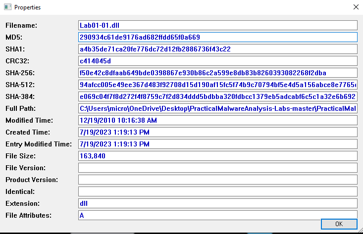  

Using [VirusTotal](https://www.virustotal.com) we are able to use the search feature and copy and paste the MD5 hashes of the files.

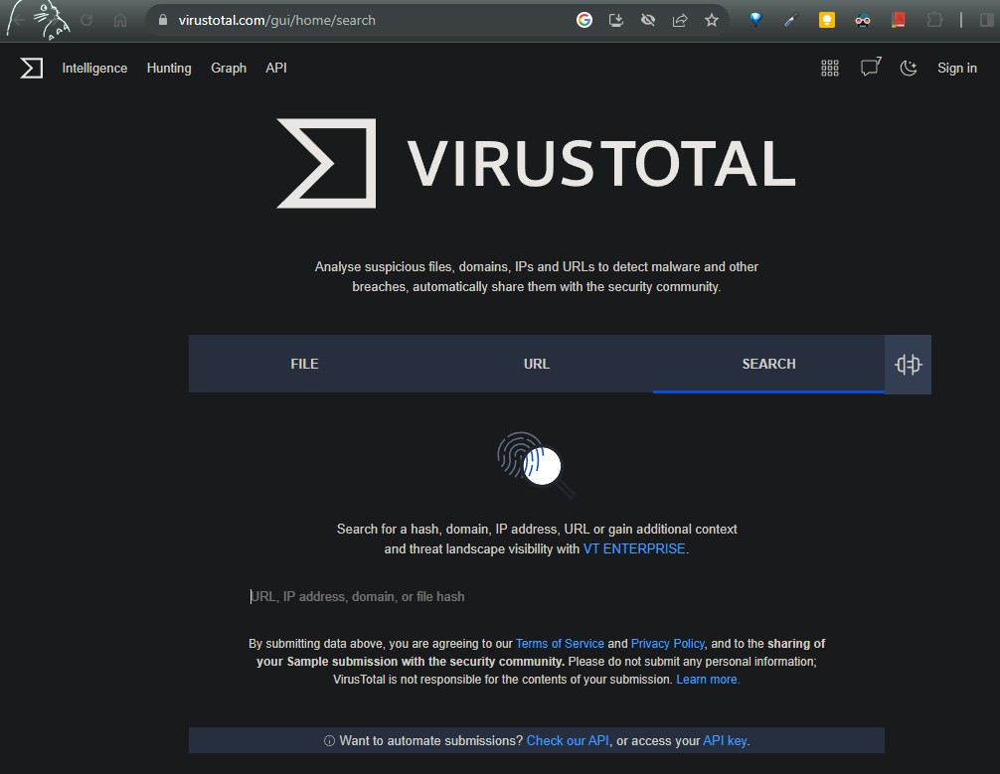

The `Lab01-01.dll` file got a hit:

The `Lab01-01.exe` file also got a hit:

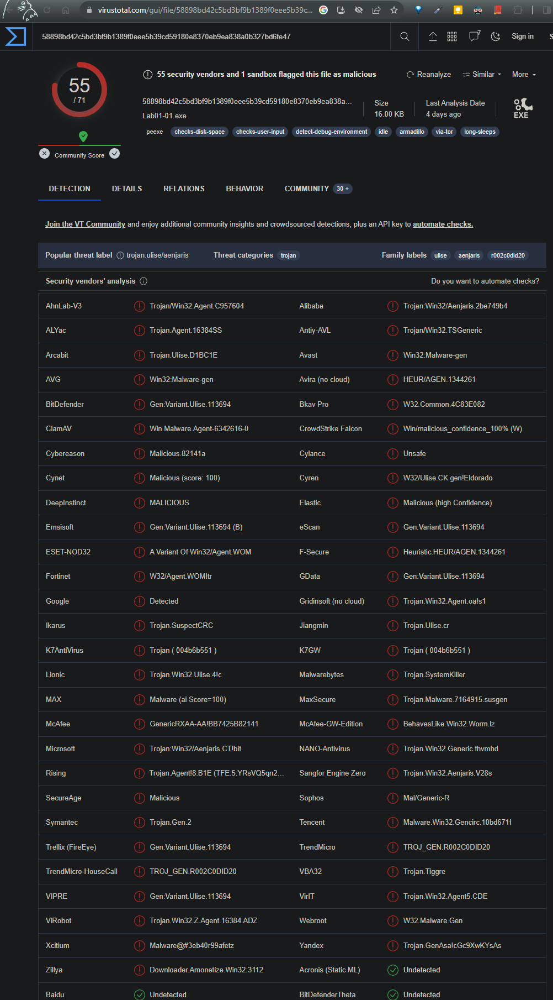

<!-- 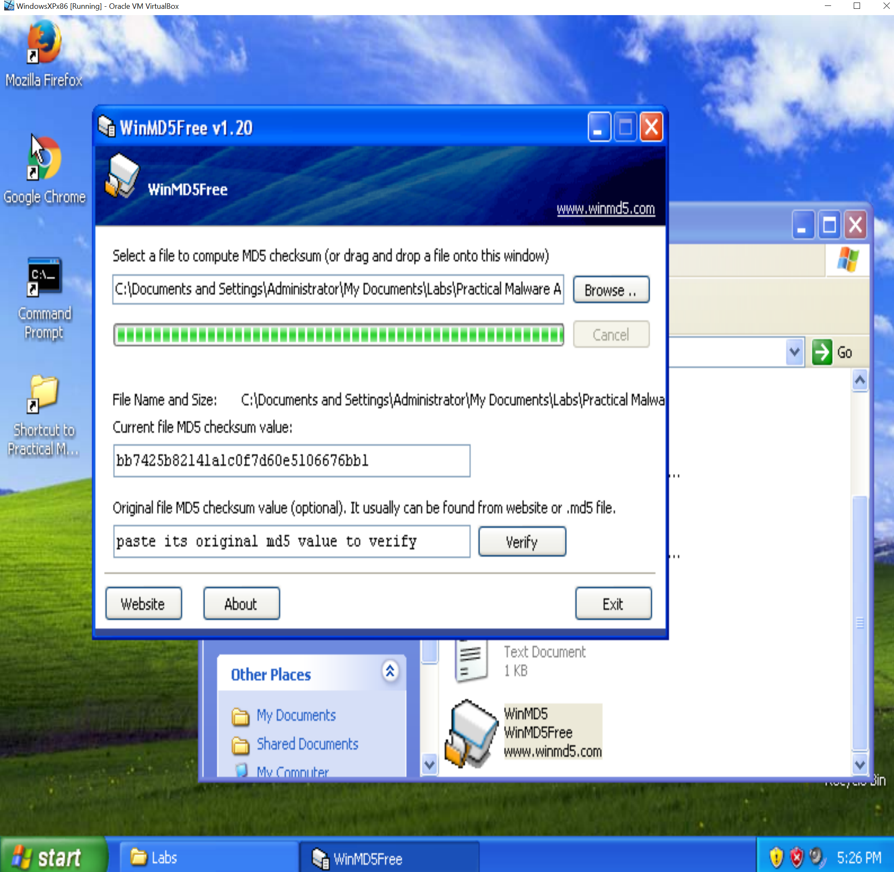

This hash can be searched for on the [Virus Total Webiste](https://www.virustotal.com/gui/home/search)

However, the virus total website search tool is not supported in Windows XP. I chose to proceed with Virus Total scan through Virus Total Scanner Application which is still supported on Windows XP. 

The search did not provide any useful information as the hash was not known to Virus Total. Entering the hash into the website search tool on a different system also did not provide any results.  -->

### Compiled Times
The lab then asks when this file was compiled. To do this we will use a tool called PEview. 

First look at the file with PEview with an omninous warning message- spooky :ghost:. 

The compile time is locate in the image file headers. Compile Time: 2010/12/19 16:16:19 UTC

### To Pack or not to Pack that is the question
The next step is to determine if the file is packed. I downloaded the PEid program to assist with this from (https://www.softpedia.com/get/Programming/Packers-Crypters-Protectors/PEiD-updated.shtml). After installing this program, I was able to select the executable file to scan. The resulsts indicated that this file was not packed but used Microsoft Visual C++ as a compiler. This was true for both the `.exe` and `.dll` files. 

### Imported Files
Question 4 wants us to look at the imports of the files. Using PEStudios we were able to view the different imports. One of the nice things about PEStudios is that it will flag different imports that are usually found in Malware!

Looking at the `.dll` file we see the following imports:

Examining the libraries it seems that this malware opens a socket to connect to something as well as creates a new process. 

Looking at the `.exe` file we see the following imports:

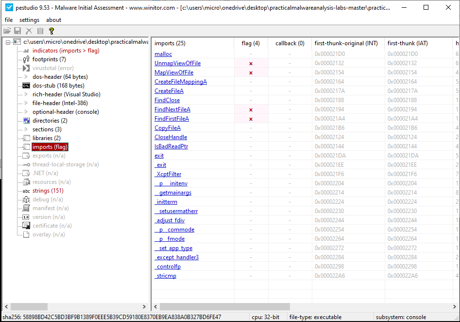

Examining the libraries it seems that this malware is going through files and looking into [UnmapViewOfFile](https://learn.microsoft.com/en-us/windows/win32/api/memoryapi/nf-memoryapi-unmapviewoffile) import we see that this will allow the memory space of the file to be overwritten. So potentially a ransomware, since it also maps the view of the file. I would assume this would be to allow the user to gain access to their files again after paying the ransom.

### Other host-based indicators
Looking at the strings of the `.exe` file we notice a `kerne132.dll` which seems to be changing the l for a 1 on the regular `KERNEL32.dll` file. It may be trying to hide itself in plain sight.

### Network-based indicators
Looking at the strings for `.dll` file we notice an IP address. This is important, since we saw in the imports it was creating a connection. We now know it was more likely reaching out to the IP address `127[.]26[.]152[.]13`.

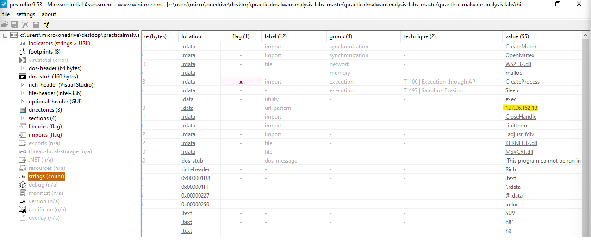

### Conclusions
Based on what we saw, we believe that these two programs may be working together for ransomware. The `.exe` file is scanning the system for files and unmapping the data locations for those files, but at the same time gathering information on where those files exist. It will probably then send that data to the IP address using the `.dll` file. Once the user has paid the ransom, the file location data can be sent back and restored.

<!-- 

 -->

## Lab 1-2
Objectives for the second sample of malware:
1. Upload the files to [Virtus Total](http://www.VirusTotal.com/) and view the reports. Does either file match any existing antivirus signatures?
2. Are there any indications that either of these files is packed or obfuscated? If so, what are these indicators?
3. Do any imports hint at what this malware does? If so, which imports are they?
4. What host- or network-based indicators could be used to identify this malware on infected machines?

### VirusTotal Results

Using HashMyFiles we were able to find the hashes of `Lab01-02.exe` 

Using [VirusTotal](https://www.virustotal.com) we are able to use the search feature and copy and paste the MD5 hash of the file.

The `Lab01-02.exe` file got a hit:

### To Pack or not to Pack that is the question

Using PEID we can check to see if the file has been packed.

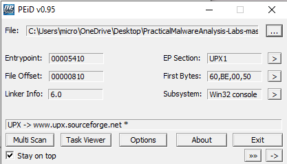

We can see that it has indeed been packed using UPX. Looking at PEStudios we can also see in the signature line that it was packed.

We can also see that the headers for the sections have also been modified, which indicate packing.

### Imported Files

Looking at the imports on PEStudios: 

There doesn't seem to be that many imports, but remembering that this is a packed binary, we can unpack it using `upx -d <filename>`

Going back into PEStudios with the unpacked file we can see the imports:

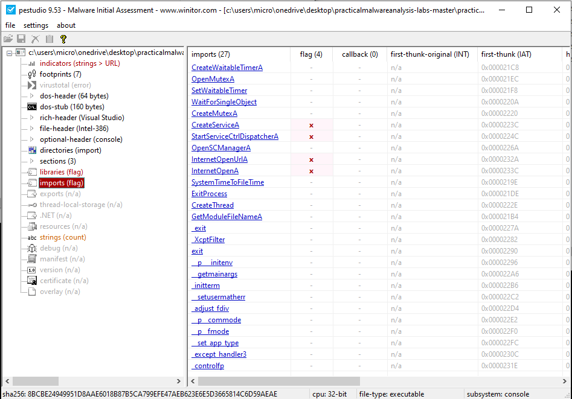

It seems that this piece of malware is opening up an Internet URL using `InternetOpenURL` (The A at the end will not show up in the documentation, but it stands for ascii). It is also creating a Service using `CreateService`.

### Other host- and network based indicators

Looking at the strings we can see a website `http://www[.]malwareanalysisbook[.]com`, which is more likely the URL that it is trying to open.

Looking further into strings, we noticed the name `MalService`, which may be the service that the malware is attempting to create.

## Lab 1-3
Objectives for the third sample of malware:
1. Upload the files to [Virtus Total](http://www.VirusTotal.com/) and view the reports. Does either file match any existing antivirus signatures?
2. Are there any indications that either of these files is packed or obfuscated? If so, what are these indicators?
3. Do any imports hint at what this malware does? If so, which imports are they?
4. What host- or network-based indicators could be used to identify this malware on infected machines?

### VirusTotal Results

Using HashMyFiles we were able to find the hashes of `Lab01-03.exe` 

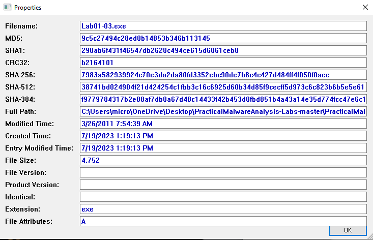

Using [VirusTotal](https://www.virustotal.com) we are able to use the search feature and copy and paste the MD5 hash of the file.

The `Lab01-03.exe` file got a hit:

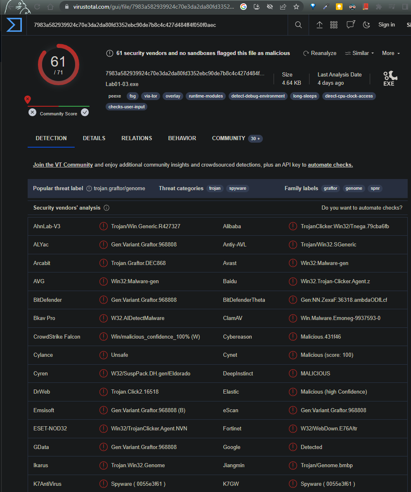

### To Pack or not to Pack that is the question

Using PEID we can check to see if the file has been packed.

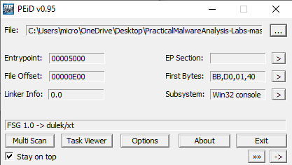

We can see that it has indeed been packed using FSG 1.0. Looking at PEStudios we can also see in the signature line that it was packed.

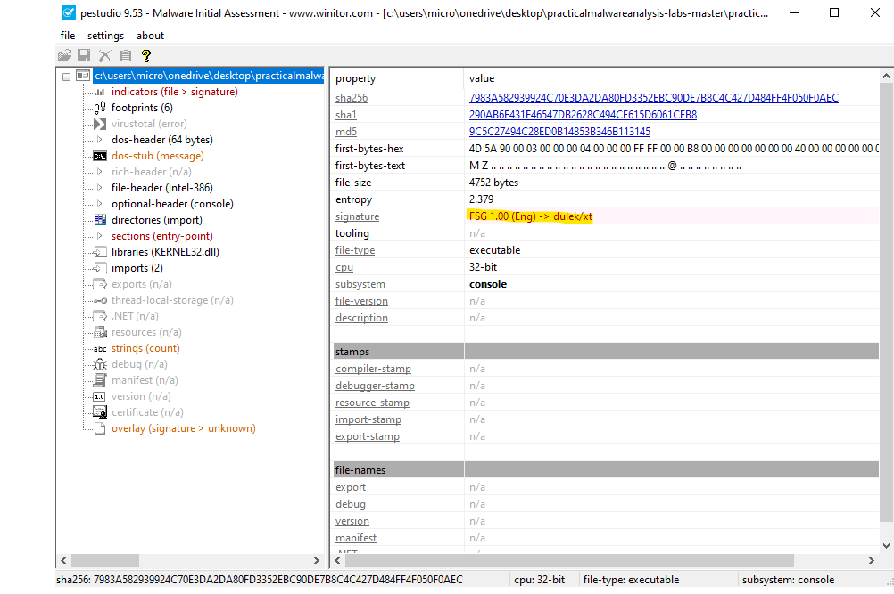

We can also see that the headers for the sections have also been modified, which indicate packing.

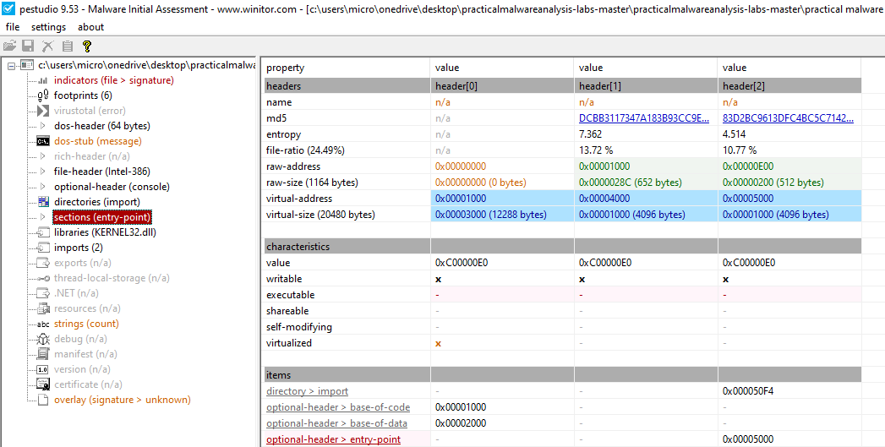

### Imported Files

Because it is packed and we have not gone that far into the book on how to unpack FSG files, we get very limited views on the imports.

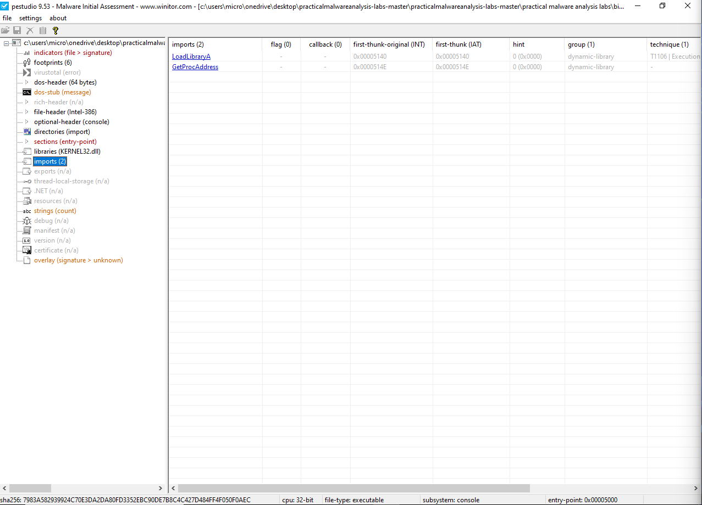

### Other host- and network based indicators

Again because it is packed we have a limited view on information. Looking at the strings we find gibberish.

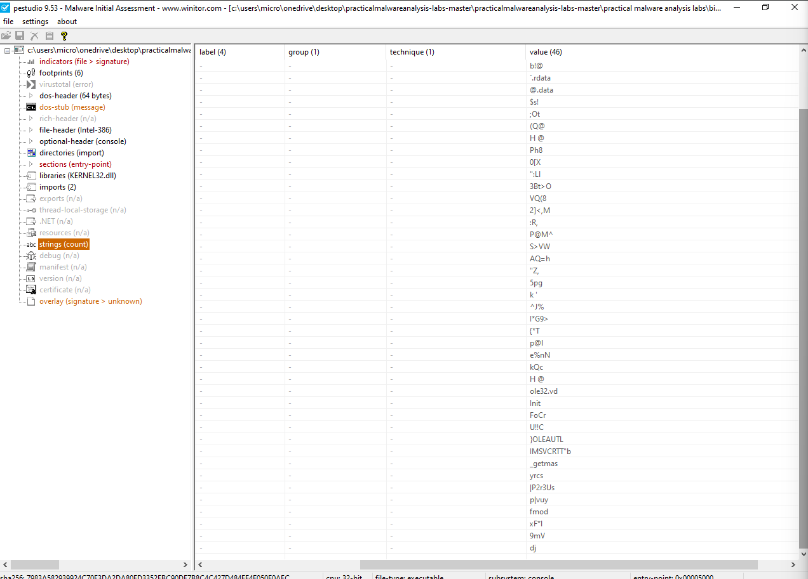

## Lab 1-4
Objectives for the fourth sample of malware:
1. Upload the files to [Virtus Total](http://www.VirusTotal.com/) and view the reports. Does either file match any existing antivirus signatures?
2. Are there any indications that either of these files is packed or obfuscated? If so, what are these indicators?
3. When was this program compiled?
4. Do any imports hint at what this malware does? If so, which imports are they?
5. What host- or network-based indicators could be used to identify this malware on infected machines?
6. This file has one resource in the resource section. Use Resource Hacker to examine that resource, and then use it to extract the
resource. What can you learn from the resource?

### VirusTotal Results

Using HashMyFiles we were able to find the hashes of `Lab01-04.exe` 

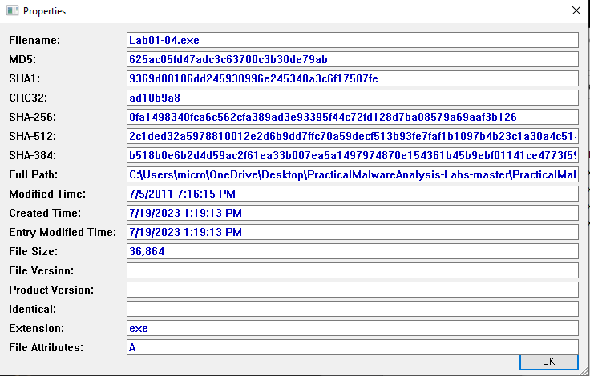

Using [VirusTotal](https://www.virustotal.com) we are able to use the search feature and copy and paste the MD5 hash of the file.

The `Lab01-04.exe` file got a hit:

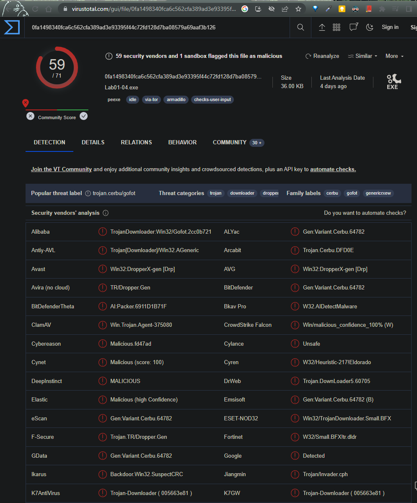

### To Pack or not to Pack that is the question

Using PEID we can check to see if the file has been packed.

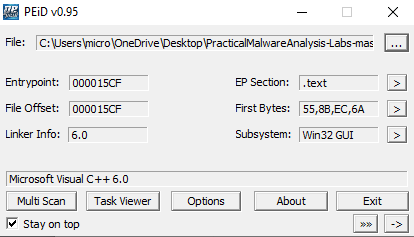

We can see it is not packed and was compiled using Microsoft Visual C++.

### Compiled Times

Using PEStudios this time to check for compile time, we can see on the front page after loading the `.exe` that it was compiled on Fri Aug 30 2019 at 22:26:59.

### Imported Files

Looking at the imports on PEStudios: 

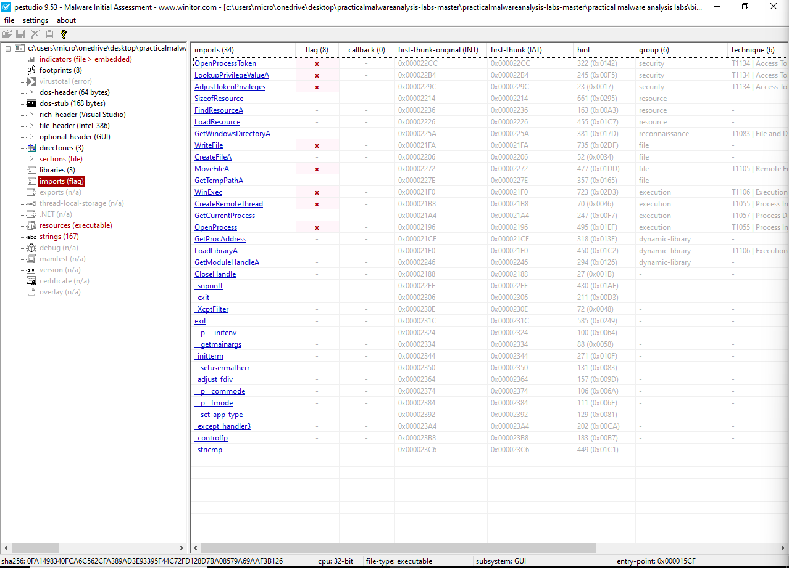

We can see a few suspicious imports. The malware seems to be finding and loading a resource. It is creating a remote thread, which means it is running inside of another process. It is also changing the token privileges, which suggests it is attempting to get admin rights. It is also creating a file and using `WinExec` to more likely run that file.

### Other host- and network based indicators

Looking at the strings of the file, we find some interesting information.

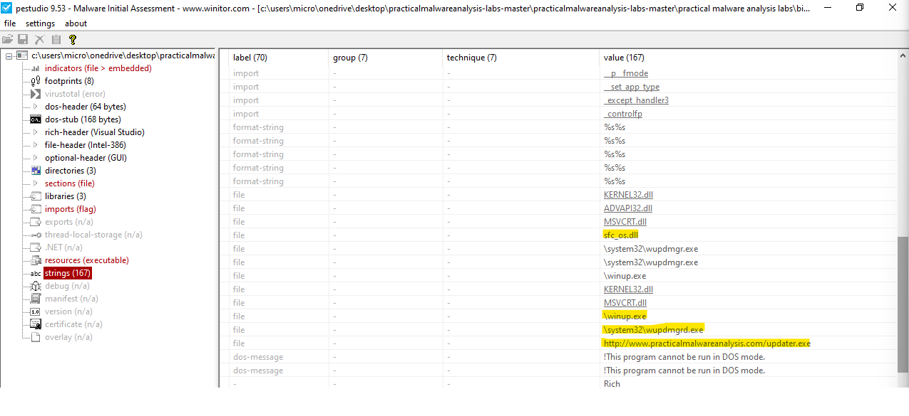

First thing I noticed was the SeDebugPrivilege, which I know is used in some vulnerabilities. We can also see that it is using URLDownloadToFile and it is going to the url `http://www[.]practicalmalwareanalysis[.]com/updater[.]exe`. Looking into `\system32\wupdmgrd.exe` it seems to be an intentional typo on the fwupdmgr which is a firmware update manager. We also notice the `winlogon.exe` string, which may be the process it is attempting to attach itself to. This is used for [secure logons](https://en.wikipedia.org/wiki/Winlogon), so it may be attempting to steal credentials.

### Resources have been hacked

Looking into the resources attached to the malware using Resource Hacker:

We see that it contains another binary that is also a PE file. It contains the url we saw earlier while running strings. After saving the PE file, we can check to see if it was packed, which it was not.

Looking at PEStudios we can see that it has a different compile time. Suggesting it may be an older piece of malware.

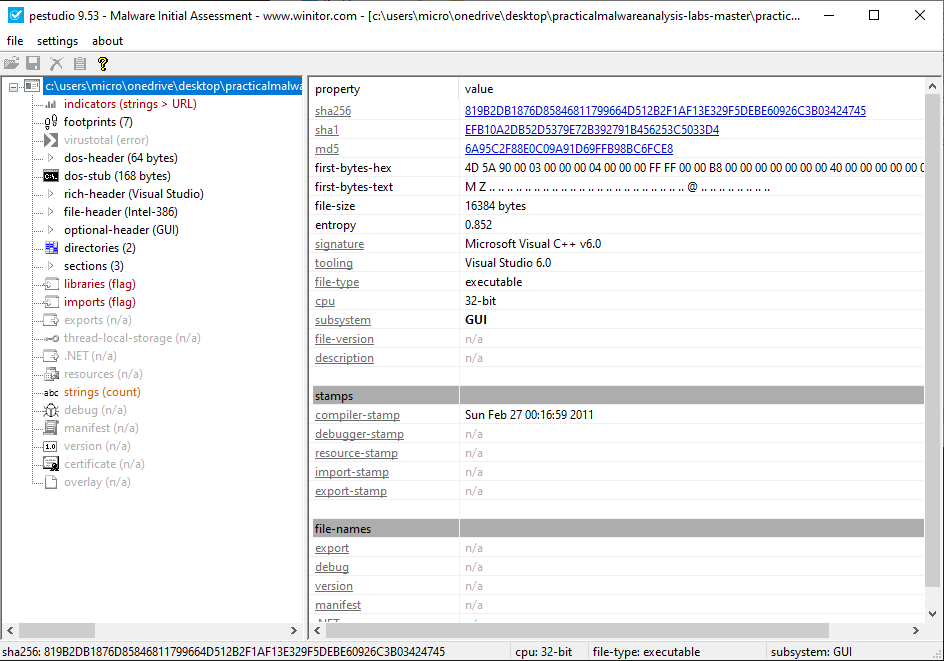

Looking at the imports we can see the URLDownloadToFile that was spotted in the strings of the original file.

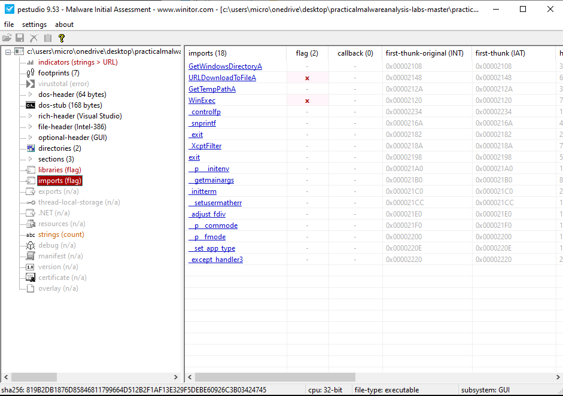

Looking at the strings we see the two files of `\winup.exe` and `\system32\wupdmgrd.exe` popping up again. Based off the imports and this information it is downloading a file from our URL we found earlier and executing it with potentially passing the other name as an argument considering we see the format string `%s%s`.

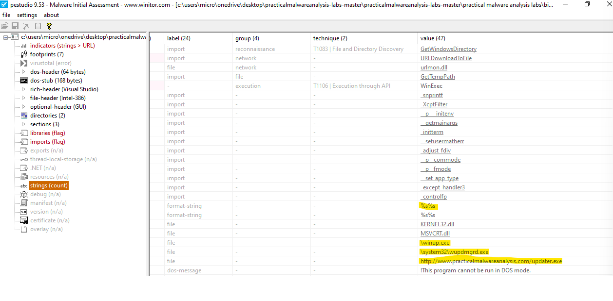

