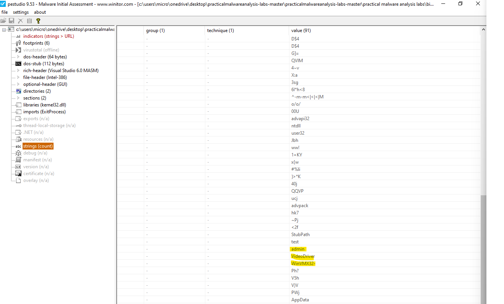
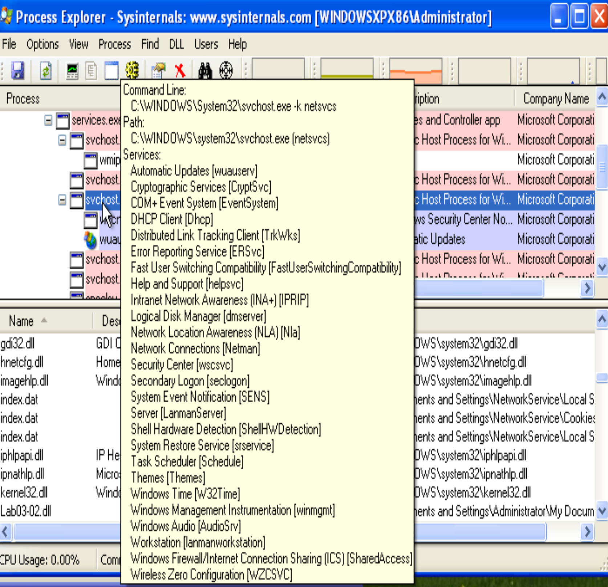
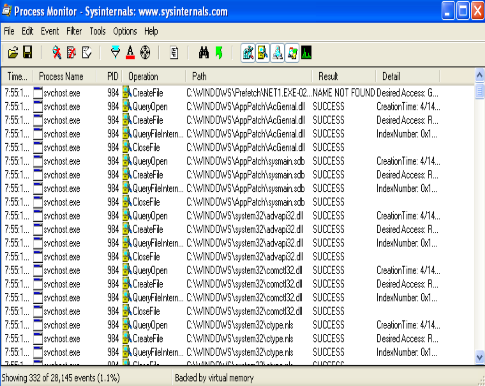
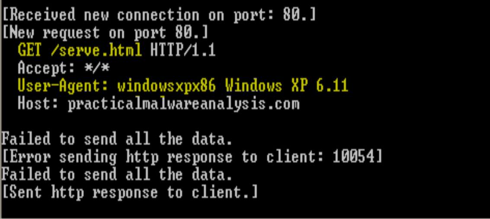
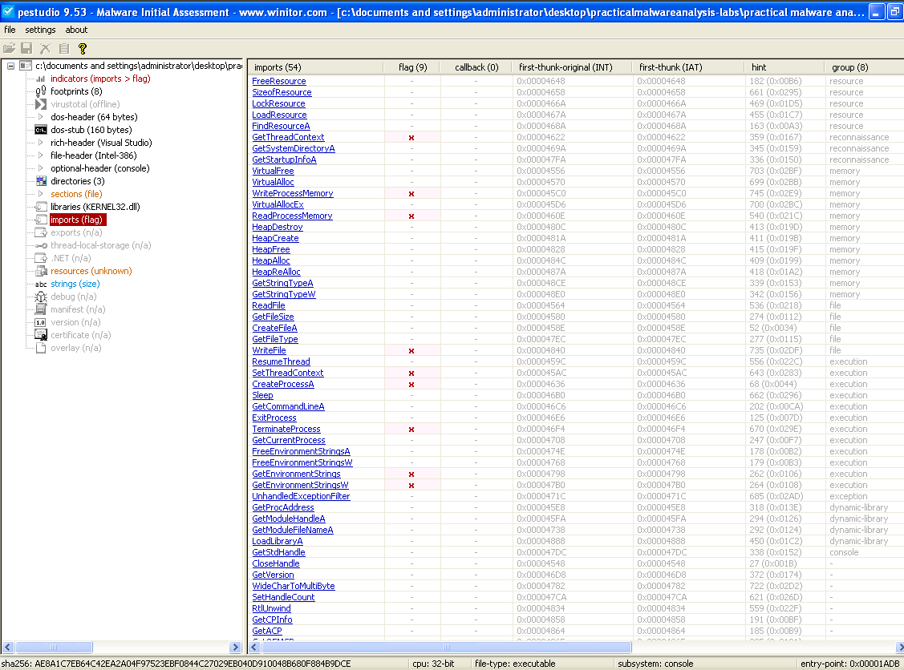
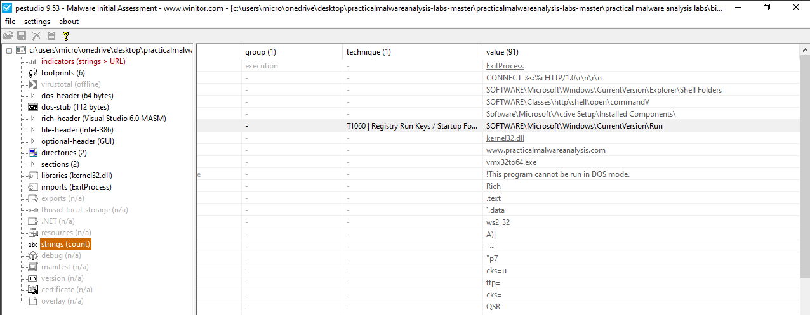
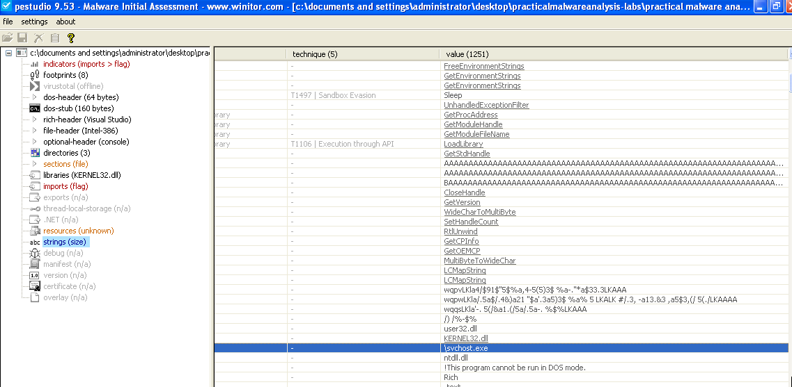
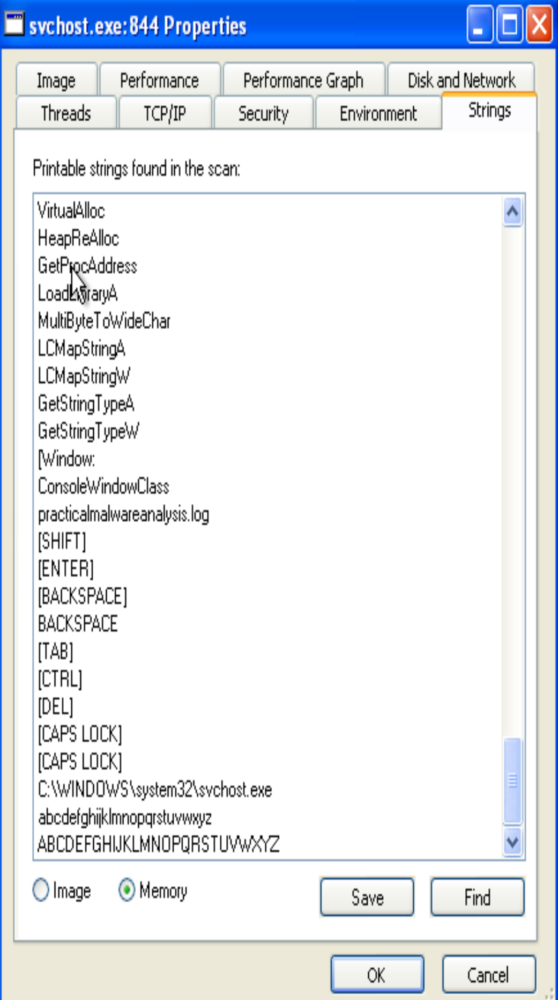
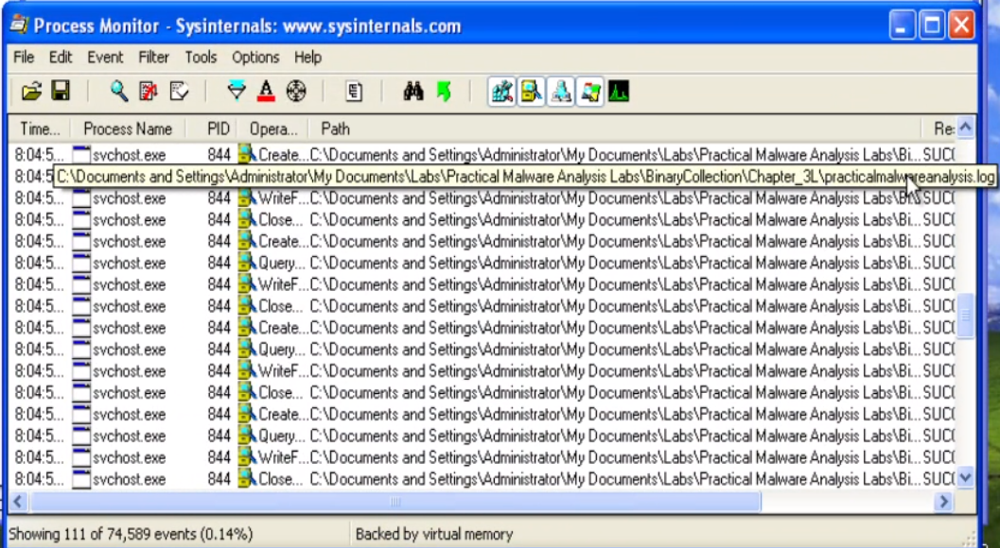
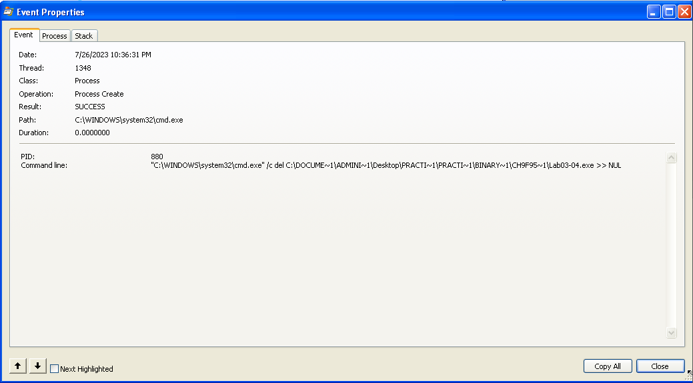

# Lab 3: Dynamic Analysis
## Lab 3-1
### Questions
1. What are this malware’s imports and strings?
2. What are the malware’s host-based indicators?
3. Are there any useful network-based signatures for this malware? If so, what are they?
### Imports and strings
Checking PEiD to see if the binary is packed.

The binary does appear to be packed with PEncyrpt 3.1

Checking PEStudio for imports and strings:

The lack of imports is another indicator that this binary was packed. Some especially interesting strings include: CONNECT, HTTP, www.practicalmalwareanalysis.com, registry keys like Software\Microsoft\Current\Verson\Run, admin, VideoDriver, and WinMX32. 

### Host-based indicators

Looking into the strings we noticed a few registry keys including `SOFTWARE\Microsoft\Windows\CurrentVersion\Run` which means the program is trying to get persistance. The `vmx32to64.exe` is more likely the name of the malware.

### Network-based indicators

Looking at [CONNECT](https://developer.mozilla.org/en-US/docs/Web/HTTP/Methods/CONNECT) for http, we can see that it is an HTTP method for creating two-way communications as a tunnel. The URL that is present in the strings is www[.]practicalmalwareanalysis[.]com

## Lab 3-2
### Questions
1. How can you get this malware to install itself?
2. How would you get this malware to run after installation?
3. How can you find the process under which this malware is running?
4. Which filters could you set in order to use procmon to glean information?
5. What are the malware’s host-based indicators?
6. Are there any useful network-based signatures for this malware?
### Imports and Strings

### Installation

Looking at the exports in PEStudio we see ordinal values followed with the names. We are assuming the name Install will help us install the malware. 

We also noticed that the properties of the executable file indicate that `installA` can be used to install the program.

Before running any malware, we will take a shot with RegShot and start ProcessExplorer as well as Procmon to record what happens after the program is installed.

### Running

We ran the following command

`C:\>rundll32.exe Lab03-02.dll, installA`

Taking another shot after installing the malware, we are able to compare added and removed keys/values. This indicates that a IPRIP service needs to be started. This also shows the executable file that the `.dll` file depends on to launch is `svchost.exe`. 

### Network-based indicators

The textbook recommends faking a network with ApateDNS and Netcat. However, ApateDNS is not easily found for windows XP. We are instead attempting to fake a network with FakeNet. 

We can then run the malware by starting the service with the following command

`C:\>net start IPRIP`

After starting the service, we first look at Process Explorer. We were able to narrow down the results by searching for the file name `Lab03-02.dll`

This indicated that the process ID for this service was `984`. This information can be used to filter results in other programs later.

Then we will take a look at the network traffic recorded on our fake network. We can see that a DNS query for `practicalmalwareanalysis.com` was made. This makes sense as this was previously noted as a suspicious string in the static analysis. The malware also makes a GET request to `serve.html` on port 80.  

The malware service was started with `C:\>net start IPRIP`. An attempt to stop this service was made with `C:\>net stop IPRIP`. It appeared to be succesful as there was no more network traffic recorded. Although it indicated that the service was stopped succesfully, I was suspicious of this. Previously, the `sleep` string was found in the file. A lack of network traffic does not necessarily indicate that the malware has been stopped. Using `sleep` is a tricky way to hide from analysts. 

After watching network traffic for a few minutes, another round of GET requests were made. The malware is still running and attempting to access the network. 

### Host-based indicators

There were 28,145 events that occured in the short time that I was capturing with Procmon. To narrow these results down to a reasonable amount, I filtered with the PID obtained from ProcessExplorer: `984`. This specific process appears to be making repeated `CreateFile`, `QueryFileInternalInformationFile`, `CloseFile`, `QueryOpen` operations. 

### Network-based Signatures

Network-based signatures can be gleaned from network traffic found on FakeNet. Because the malware is making `GET` requests to `serve.html` on port 80 and DNS Queries to `practicalmalwareanalysis.com`, these can be used as network signatures to create YARA rules. Another network signature could possibly be `Windows XP 6.11`. This User Agent shows up with the name of the VirtualMachine it is running in. 

## Lab 3-3

1. What do you notice when monitoring this malware with Process Explorer?
2. Can you identify any live memory modifications?
3. What are the malware’s host-based indicators?
4. What is the purpose of this program?

### Static Analysis

Checking PEID: Not packed

Checking PEStudios:

It seems that it is grabbing something from the resource section of its memory. It is doing something with the Heap, writing files, creating processes, and looking at the environment variables of the current process.

There seems to be a file located in the .rsrc area of memory. The name seems to be UNICODE to potentially hide itself.

We see some weird strings that are varying length of `A`. We also noticed that `\svchost.exe` is a string.

It looks like the malware is creating error code, maybe for testing?

### Process Explorer

The binary seems to open up a process called `svchost.exe` and then closes the program, leaving behind the orphaned process.

### Live memory modifications

Looking at the strings from the process, we noticed that the memory and image strings were different. 

A few of the strings stood out. There was a `practicalmalwareanalysis.log` and a bunch of keyboard extra keys. We are guessing that this may be some type of keylogger.

### Host-based indicators

We decided to test our theory by opening up Notepad and writing `test test`. This seemed to trigger more data on procmon.

Looking at procmon, we were able to narraw down our attention to the PID of that fake `svchost.exe` and see that it was writing to the `practicalmalwareanalysis.log`, which was our string from earlier. 

Looking at that log file that was written we can see:

It does seem to be a key logger with a good bit of data. It is telling you that the keystrokes are coming from Notepad and the name of the file is Untitled. You can also see where we hit enter multiple times after writing `test test`. Looking more deeply into the file you can also see how we were on process monitor filter tab and trying in our filter. Also where we were looking for Notepad in the Start Menu. This is a lot of excellent data that they are collecting. 

This key logger has the data needed to easily look for accidentally typed passwords in the wrong areas.

## Lab 3-4

1. What happens when you run this file?
2. What is causing the roadblock in dynamic analysis?
3. Are there other ways to run this program?

### Static Analysis

Looking at PEID: The binary was not packed.

Looking at PEStudio:

We can see that it is doing things with the registry, writing files, creating services, creating processes, and making network connections.

The strings show us a few interesting tidbits. We can see the days and months concatenated into a single string. Each with 3 characters, which would make it easy to index. 

There are also a few all caps words, such as, GET, CMD, DOWNLOAD, UPLOAD, NOTHING, and SLEEP. It makes me think of a command and control center. Where you are issuing commands to the program to do certain tasks.

### Running the file

Upon running the file, it instantly closes. Nothing shows up in process explorer.

We can see that it is creaing a process for `cmd.exe` and it is deleting itself. We currently don't have the tools to continue with this piece of malware.