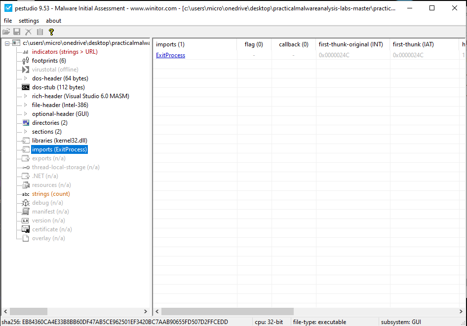
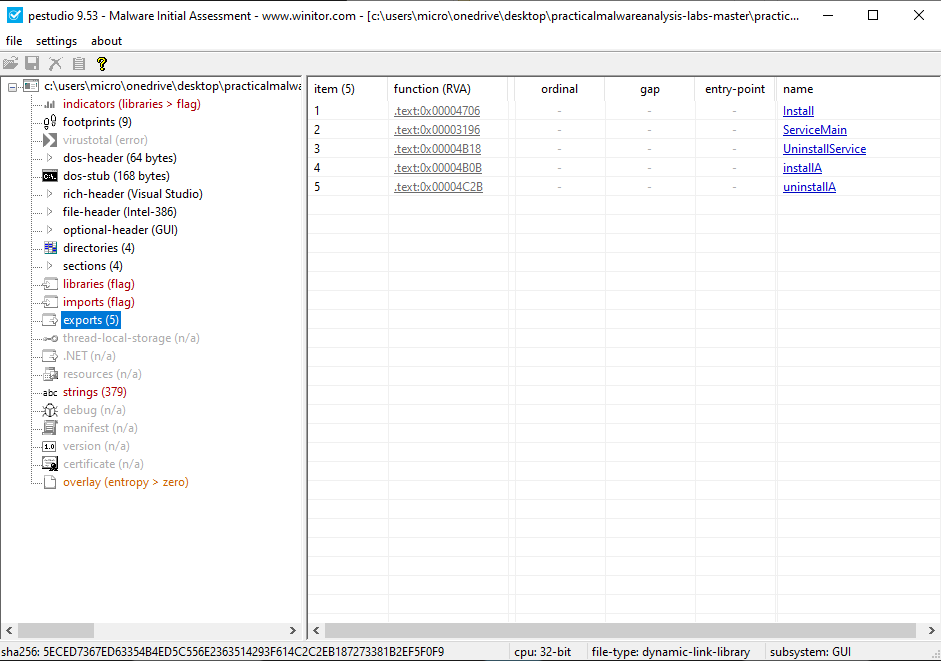
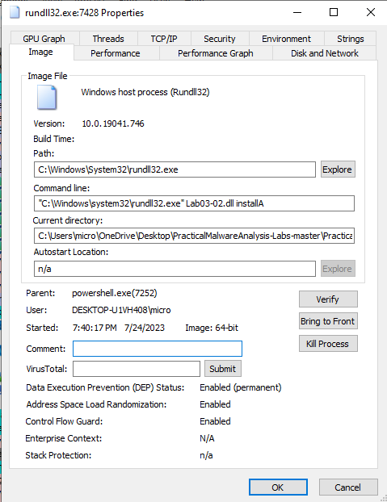
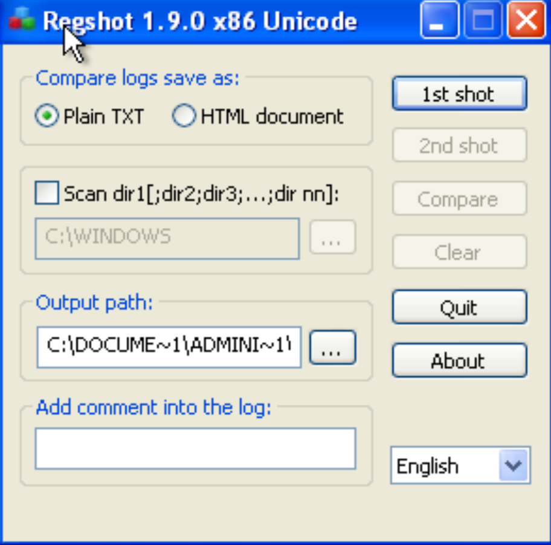
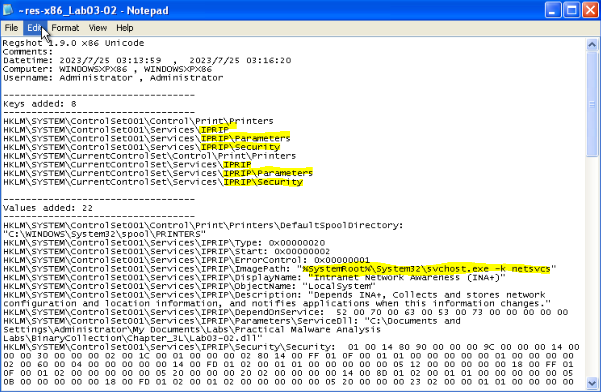

# Lab 3: Dynamic Analysis
## Lab 3-1
### Questions
1. What are this malware’s imports and strings?
2. What are the malware’s host-based indicators?
3. Are there any useful network-based signatures for this malware? If so, what are they?
### Imports and strings
Checking PEiD to see if the binary is packed.

The binary does appear to be packed with PEncyrpt 3.1

Checking PEStudio for imports and strings:

The lack of imports is another indicator that this binary was packed. Some especially interesting strings include: CONNECT, HTTP, www.practicalmalwareanalysis.com, registry keys like Software\Microsoft\Current\Verson\Run, admin, VideoDriver, and WinMX32. 

### Host-based indicators

Looking into the strings we noticed a few registry keys including `SOFTWARE\Microsoft\Windows\CurrentVersion\Run` which means the program is trying to get persistance. The `vmx32to64.exe` is more likely the name of the malware.

### Network-based indicators

Looking at [CONNECT](https://developer.mozilla.org/en-US/docs/Web/HTTP/Methods/CONNECT) for http, we can see that it is an HTTP method for creating two-way communications as a tunnel. The URL that is present in the strings is www[.]practicalmalwareanalysis[.]com

## Lab 3-2
### Questions
1. How can you get this malware to install itself?
2. How would you get this malware to run after installation?
3. How can you find the process under which this malware is running?
4. Which filters could you set in order to use procmon to glean information?
5. What are the malware’s host-based indicators?
6. Are there any useful network-based signatures for this malware?
### Installation

Looking at the exports in PEStudio we see ordinal values followed with the names. We are assuming the name Install will help us install the malware. Before running any malware, we will take a shot with RegShot and start ProcessExplorer as well as Procmon to record what happens after the program is installed.

Running the following command

`C:\>rundll32.exe Lab03-02.dll, installA`

### Running

Taking another shot after installing the malware, we are able to compare added and removed keys/values. This indicates that a IPRIP service needs to be started. This also shows the executable file that the `.dll` file depends on to launch is `svchost.exe`. 

We can then run the malware by starting the service with this command:

`C:\>net start IPRIP`

### Network-based indicators

### Imports and strings

### Host-based indicators

### Network-based indicators

# Dynamic Analysis of Lab 3

